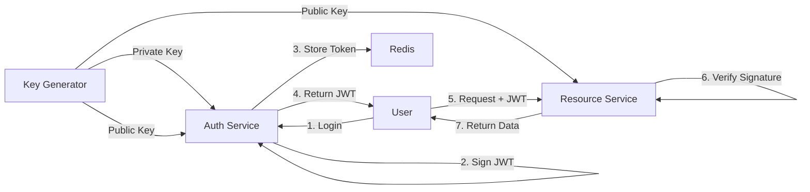

# JWT OAuth2 Learning Project

A clean, educational project to learn JWT and OAuth 2.0 (RS256) with Java 21, Spring WebFlux, and Redis.

## Architecture



## Modules
1. **key-generator**: Generates RSA 2048-bit keys.
2. **auth-service**: Issues JWT tokens.
3. **resource-service**: Validates JWT tokens.

## Prerequisites
- Java 21
- Docker (for Redis)

## Step-by-Step Run Guide

### 1. Generate Keys
```bash
./gradlew :key-generator:compileJava
java -cp key-generator/build/classes/java/main com.learning.keygenerator.Main
```

### 2. Start Redis
```bash
docker run -d --name jwt-redis -p 6379:6379 redis
```

### 3. Start Auth Service (Terminal 1)
```bash
./gradlew :auth-service:bootRun
```
*Runs on port 8080*

### 4. Start Resource Service (Terminal 2)
```bash
./gradlew :resource-service:bootRun
```
*Runs on port 8081*

### 5. Test the Flow

#### Option A: Using Postman
1. Import the file `postman_collection.json` located in the root of this project.
2. Run request **"1. Get Token"**. It will automatically save the token to a variable.
3. Run request **"3. Secure Data"**. It will use the saved token.

#### Option B: Using cURL (Terminal)

**1. Get Token (Auth Service)**
```bash
curl --location --request POST 'http://localhost:8080/oauth/token?grant_type=password&username=admin&password=123456'
```
*Response:*
```json
{
    "access_token": "eyJhbGciOiJSUzI1Ni...",
    "token_type": "Bearer",
    "expires_in": "3600"
}
```

**2. Public Info (Resource Service)**
```bash
curl --location 'http://localhost:8081/public/info'
```

**3. Secure Data (Resource Service)**
*Replace `<ACCESS_TOKEN>` with the token from step 1.*
```bash
curl --location 'http://localhost:8081/api/secure-data' \
--header 'Authorization: Bearer <ACCESS_TOKEN>'
```

## Concepts Learned
- **RS256**: Asymmetric signing (Private signs, Public verifies).
- **WebFlux Security**: Reactive security chain.
- **Redis**: Used here for potential token storage/revocation (configured in auth-service).
